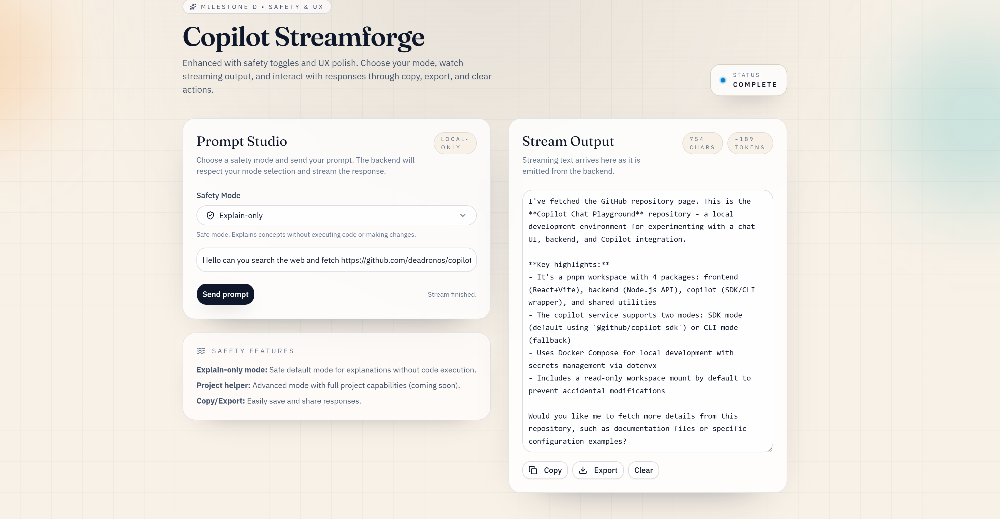
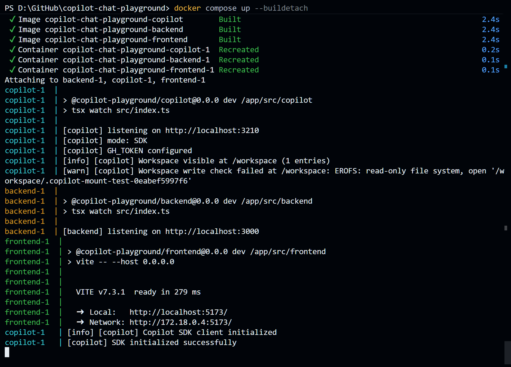

# Copilot Chat Playground

A local playground for experimenting with a chat UI + backend + Copilot integration. The Docker Compose stack works locally (frontend, backend, and copilot services), and the Copilot service supports both the **Copilot SDK (default)** and the **Copilot CLI (fallback)**.

This repo is a **pnpm workspace** with separate packages under `src/`.

## Demo Screenshot

Frontend ran a prompt against the Copilot service using the SDK mode.


Docker up and running

YouTube Demo Video:
[YouTube Demo Video](https://www.youtube.com/watch?v=ycVCQS6mjZg)
Demo Video downscaled here:
[Demo Video in Repo](./Copilot_Chat_PlayGround_Docker.mp4)

## Packages

- `src/frontend` — Vite + React + shadcn/ui UI
- `src/backend` — Node.js API (streaming bridge; scaffold)
- `src/copilot` — **Copilot SDK** / Copilot CLI wrapper service (uses SDK by default)
- `src/shared` — shared types/utilities (LogEvent, EventBus, NDJSON helper)

## Module layout (post-refactor)

- Backend routing stays thin in `src/backend/src/app.ts`; services live in `src/backend/src/services/*`.
- ChatPlayground UI is split into a container (`src/frontend/src/components/chat-playground.tsx`) and presentational components (`src/frontend/src/components/chat-playground/*`).
- RedVsBlue engine core + entities live under `src/frontend/src/redvsblue/engine/*`, with higher-level orchestration in `src/frontend/src/redvsblue/*`.

## Easter egg: RedVsBlue

There’s an “eastergg” in the playground: **RedVsBlue**, a mini game orchestrated and mediated by Copilot. It lives in the frontend and uses the backend’s RedVsBlue endpoints for match lifecycle, snapshots, and AI commentary.

## CI guardrails

- Coverage thresholds are enforced per package (backend/frontend/copilot) via `vitest` coverage settings.
- Router thinness is enforced by a simple line-count guard: `pnpm ci:guardrails` (see `scripts/ci/check-router-thin.mjs`).

## Getting started

1. Enable pnpm via Corepack (recommended)

   - `corepack enable`

2. Install deps

   - `pnpm install`

3. Run everything in dev

   - `pnpm dev`

### Run just one service

- `pnpm dev:frontend`
- `pnpm dev:backend`
- `pnpm dev:copilot`

### Copilot Service Modes

The copilot service supports two modes:

1. **SDK Mode** (default): Uses `@github/copilot-sdk` for structured streaming with full event support
2. **CLI Mode**: Direct CLI spawning for simpler use cases

Set `USE_COPILOT_SDK=false` in your environment to use CLI mode.

### Chat UX enhancements

- End-to-end streaming supports cancel + retry controls in the main chat UI.
- Conversation history is persisted locally so the latest session can be resumed after refresh.
- An observability panel exposes Copilot health/models/metrics and backend observability summary from the frontend.

## Secrets & dotenvx

For Docker/Compose usage with encrypted `.env` files, see the repo guidance in [`docs/library/dotenvx/README.md`](docs/library/dotenvx/README.md). It documents safe-by-default key handling, recommended secret injection patterns, and install options.

**Tip:** Commit a `.env.example` or `.env.sample` (without secrets) that documents required environment variables and example shapes. Do not commit actual `.env` files or any real secrets — use `.env.example` solely as a reference for developers.

### Docker / Compose

For running containers (including Milestone E workspace mounts) prefer a **secrets-first** approach:

- Keep `.env.keys` out of source control (it contains `DOTENV_PRIVATE_KEY_*`). The repo already ignores it via `.gitignore` and keeps it out of the Docker build context via `.dockerignore`.
- Inject secrets at **runtime** (Docker secrets / orchestrator secrets / mounted secret file). Do **not** bake secrets into images.
- Avoid passing secrets on the CLI (e.g., `docker run -e ...` or `DOTENV_PRIVATE_KEY_*=... docker compose up`) except as a small **dev-only** convenience.

This repo’s `src/copilot/entrypoint.sh` supports reading secrets from `/run/secrets/` and exporting them into env at container start:

- `DOTENV_PRIVATE_KEY_*` (for `dotenvx` runtime decryption)
- `GH_TOKEN` / `GITHUB_TOKEN` (Copilot auth)

See [`docs/milestone-e-workspace-mount.md`](docs/milestone-e-workspace-mount.md) for workspace-mount specific guidance and warnings. For an end-to-end quick start and troubleshooting steps, see the Docker setup guide: [`docs/docker-setup-guide.md`](docs/docker-setup-guide.md).

**Docker build tip:** When installing dependencies inside Docker, prefer deterministic installs by using a frozen lockfile. Example in a Dockerfile:

```dockerfile
RUN corepack enable && pnpm install --frozen-lockfile --prod
```

Keeping `pnpm-lock.yaml` available to Docker builds helps ensure reproducible images (do not add it to `.dockerignore` if you expect it to be used during image builds).

Quick verification — Docker & Copilot ✅

- Build & run the full stack:
  - `docker compose up --build`
  - Or run detached: `docker compose up -d --build`
- Verify running services:
  - `docker compose ps`
  - `docker compose logs -f copilot`
- Check Copilot health and mode (works for SDK and CLI):
  - `curl -s http://localhost:3210/health | jq .` (inspect `mode`, `tokenConfigured`, `binaryAvailable`)
- Quick API test (requires `GH_TOKEN` configured):
  - `curl -X POST http://localhost:3210/chat -H 'Content-Type: application/json' -d '{"prompt":"What is GitHub Copilot?"}'`

Note: The Copilot service uses the **SDK by default**. To force the CLI fallback set `USE_COPILOT_SDK=false` (env or Compose override).

## Workspace mount (read-only default)

- The Compose stack mounts the host `./workspace` into the `copilot` container as a **read-only** bind mount by default (e.g. `./workspace:/workspace:ro`) to avoid accidental modification of your working tree or host secrets.
- If you need write access for builds or tests, prefer a **named volume** or a dedicated writable path instead of making the entire repo writable.
- To enable writable access in a dev-only override, create a `docker-compose.override.yml` and adjust the `volumes` entry for `copilot`, for example:

```yaml
services:
  copilot:
    volumes:
      - ./workspace:/workspace:rw
```

- Quick verification inside a running container:

```bash
# Should print "read-only mount" when mount is read-only
docker compose exec copilot sh -c 'touch /workspace/should_fail 2>/dev/null || echo "read-only mount"'
# Inspect mount options on Linux
docker compose exec copilot sh -c 'grep /workspace /proc/mounts || mount | grep /workspace'
```

See `docs/milestone-e-workspace-mount.md` for additional checks and safety guidance.

## Getting started

1. Enable pnpm via Corepack (recommended)

   - `corepack enable`

2. Install deps

   - `pnpm install`

3. Run everything in dev

   - `pnpm dev`

### Run just one service

- `pnpm dev:frontend`
- `pnpm dev:backend`
- `pnpm dev:copilot`
