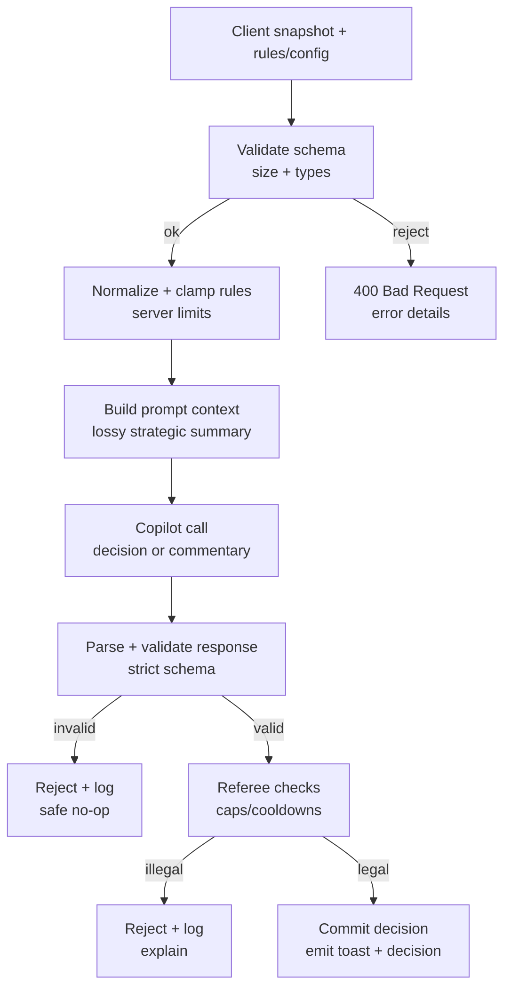
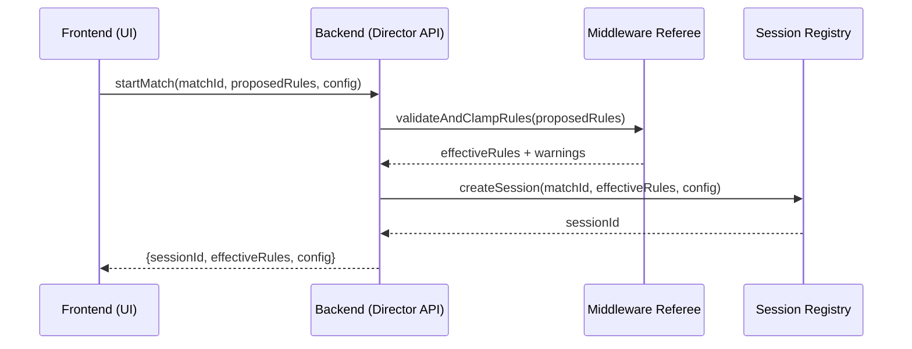
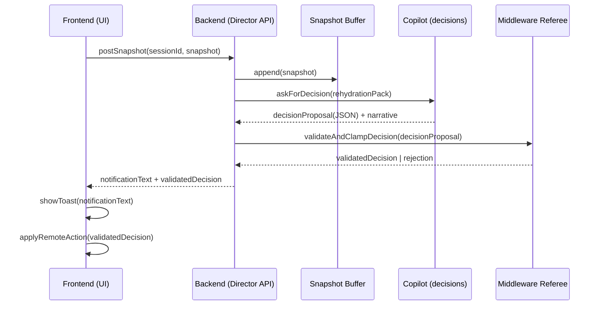
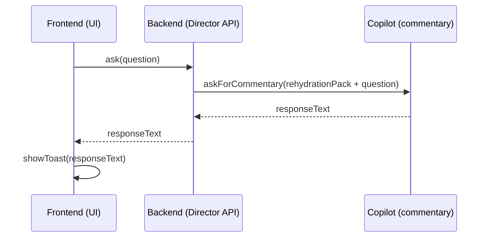
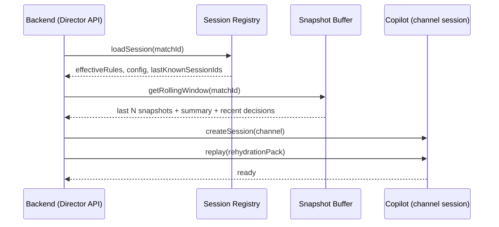

# Red vs Blue — AI Director (Copilot) High-Level Architecture

This document describes the **high-level architecture** for adding an AI “Director” to the Red vs Blue space combat demo.

The design intentionally follows **Pattern C: Middleware Referee**:

- The AI can *suggest* actions (e.g., “spawn 3 red ships”).
- The backend referee validates and clamps the suggestion to server-enforced constraints.
- The frontend applies only **validated** decisions.

## Goals

- Add match-long AI assistance to keep battles engaging (support the weaker side when appropriate).
- Keep the simulation stable and safe (prevent AI “cheating”, runaway spawning, or invalid actions).
- Keep prompts focused by sending **lossy strategic snapshots** rather than full world coordinates.
- Support **two channels**:
  - **Commentary**: narration/toasts (“Team Red is gaining the upper hand…”) — optional streaming (SSE).
  - **Decisions**: structured action proposals — request/response first.

## Non-goals

- Real-time authoritative server simulation (the engine remains in the frontend/worker).
- Allowing the model to directly mutate engine state.
- Complex economy systems (points/mana) in v1 (can be added later).

## Components

- **Frontend (RedVsBlue UI)**
  - Runs the simulation engine (optionally in a worker).
  - Produces lossy strategic snapshots.
  - Shows toasts and optionally applies validated decisions.
  - Provides UI controls: manual “Ask Copilot”, enable/disable auto-decisions.

- **Backend (Director API + Middleware Referee)**
  - Validates client snapshots and proposed rules.
  - Maintains match session registry and rolling snapshot buffer.
  - Calls Copilot via the Copilot service.
  - Validates/clamps AI decisions; logs proposed vs effective.

- **Copilot service (Copilot SDK)**
  - Executes the LLM calls (two channels).
  - Provides session semantics per match.

## System overview (containers and flows)

```mermaid
flowchart LR
  subgraph Browser[Browser]
    UI[RedVsBlue UI]
    ENG[Simulation Engine
    (main thread or worker)]
    UI -->|controls| ENG
    ENG -->|lossy snapshot| UI
  end

  subgraph Server[Backend]
    API[Director API]
    REF[Middleware Referee
    validate + clamp + log]
    REG[Session Registry
    (matchId → sessions)]
    BUF[Rolling Snapshot Buffer
    (last N / token budget)]
    API --> REF
    API --> REG
    API --> BUF
  end

  subgraph Copilot[Copilot Service]
    COP[COPILOT SDK
    two channels]
  end

  subgraph Model[LLM]
    LLM[Model]
  end

  UI -->|start match, rules, config| API
  UI -->|periodic snapshot (default 30s)| API
  UI -->|manual ask| API

  API -->|prompt: commentary| COP
  API -->|prompt: decision JSON| COP
  COP --> LLM
  LLM --> COP
  COP --> API

  API -->|toast + validated decision| UI
  UI -->|apply decision via engine API| ENG
```

## Transport strategy

- **Decisions**: start with **request/response** (simple and testable).
  - Frontend sends snapshot → backend returns `notificationText` + `decision` JSON.
- **Commentary**: optionally add **SSE** for streaming narration.
  - Keep commentary non-authoritative; it never directly mutates state.
- **WebSockets**: defer until needed (e.g., low-latency push decisions, interactive abort).

## Session strategy (match-long per channel)

We keep **one match-long session per channel**:

- `commentary` channel: narrative, high-level performance feedback.
- `decisions` channel: strict JSON-only output with a schema.

The backend can rehydrate sessions from the last $N$ snapshots to bound context.

### Rehydration rules (bounded context)

- Use **hybrid bounds**: stop adding snapshots when any bound is hit:
  - count (default: 25 snapshots)
  - time window (optional)
  - token budget (with a safety factor, e.g. 0.7)
- Rehydration pack layering:
  1. Effective rules config (normalized/clamped)
  2. Latest snapshot
  3. Strategic summary (periodically generated)
  4. Last few decisions + outcomes
  5. Tail messages for the channel

### Restart behavior

- If the backend restarts or Copilot sessions are not resumable:
  - Recreate the Copilot session for the channel.
  - Replay the rehydration pack.
- Decisions must be **idempotent** using `requestId` (never apply the same decision twice).

## Rules source of truth and safety

- The **frontend proposes rules** at match start (e.g., spawn caps, cooldowns, desired balance).
- The **backend validates, normalizes, and clamps** rules to server-enforced limits.
- The backend logs both:
  - `proposedRules`
  - `effectiveRules` (after clamping)

### Middleware Referee pipeline



## Core sequences

### 1) Match start (rules negotiation)



### 2) Periodic snapshot → decision (request/response)



### 3) Manual “Ask Copilot”



### 4) Rehydrate after backend restart



## Phased delivery plan (design specs in Memory Bank)

This architecture is intentionally delivered in phases, each with a dedicated Memory Bank design/spec.

- **Phase 1 — Contracts + match lifecycle + commentary MVP**
  - Design: `memory/designs/DES012-redvsblue-ai-director-phase1-contracts-and-commentary.md`
- **Phase 2 — Decision pipeline (request/response) + middleware referee validation**
  - Design: `memory/designs/DES013-redvsblue-ai-director-phase2-decision-pipeline.md`
- **Phase 3 — Periodic snapshots + auto-decisions toggle + rate limits**
  - Design: `memory/designs/DES014-redvsblue-ai-director-phase3-auto-decisions.md`
- **Phase 4 — Resilience (rehydration), summarization/compaction, observability**
  - Design: `memory/designs/DES015-redvsblue-ai-director-phase4-resilience-and-observability.md`

## Suggested defaults

- Snapshot cadence: 30s (frontend configurable)
- Rehydration window: last 25 snapshots (plus token budget bound)
- Decision cooldown: 60s (server-enforced), configurable within safe bounds
- Spawn caps: hard cap per decision + per minute + per match (server-enforced)
